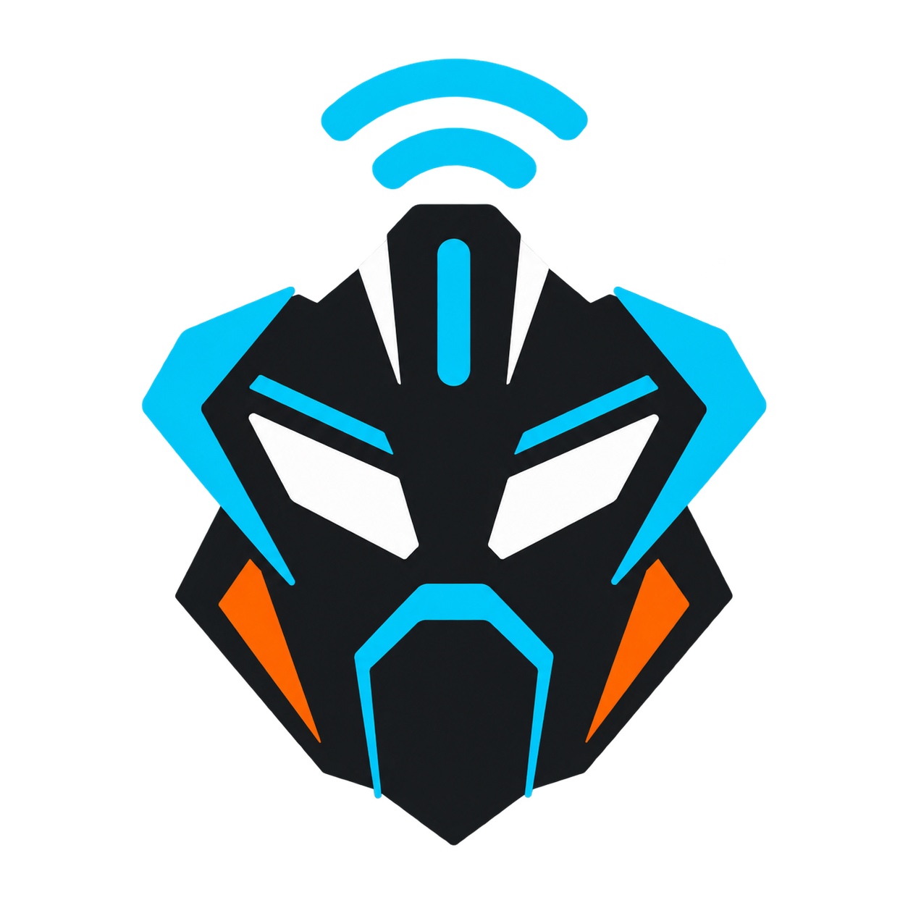

<div align="center">



# 800NK ADV Link

### Wireless Android Auto for the CFMOTO 800NK Advanced

Connect an Android phone to the motorcycle's MotoPlay display over Wi-Fi, use Android Auto from the
touchscreen, and keep ride diagnostics in one model-specific application.

[](https://github.com/zirryzero/app-cfmoto/releases)
[](https://github.com/zirryzero/app-cfmoto/releases)
[](https://ko-fi.com/zirryzero)
[](LICENSE)

**[English](#english) | [Español](#español)**

</div>

---

> **Derivative and unofficial project.** 800NK ADV Link was not created from scratch. It is a
> model-specific adaptation of [OpenCfMoto](https://github.com/zanderp/open-cfmoto), originally
> developed by Alexandru and the OpenCfMoto contributors. Original authorship and incorporated-code
> notices are preserved in [NOTICE](NOTICE). This project is not affiliated with or endorsed by
> CFMOTO, Carbit, Google, or Android Auto.

# English

## Scope

800NK ADV Link intentionally supports one motorcycle and one dashboard contract:

| Item | Supported configuration |
| --- | --- |
| Motorcycle | **CFMOTO 800NK Advanced** |
| Pairing screen | MotoPlay / Carbit QR |
| Expected `modelId` | `37426` when present |
| Head unit | CFDL26 / EasyConn |
| Transport | Bike-hosted Wi-Fi SoftAP |
| Touch panel | `720 x 712` |
| Default Android Auto stream | Optimized landscape `1280 x 720`, `160 dpi` |
| Default dash margin | Top `22 px` |

The app does not include alternative motorcycle profiles, Wi-Fi Direct, phone-hosted hotspot mode,
or protocols intended for other dashboard families. A QR without `modelId` can be accepted when it
contains the required Wi-Fi fields; a QR that explicitly identifies another model is rejected.

See [docs/800NK-ADVANCED.md](docs/800NK-ADVANCED.md) for the technical dashboard contract.

## Features

| Feature | Description |
| --- | --- |
| **Wireless Android Auto** | Projects Google Maps, Waze, media, calls, and compatible Android Auto apps to MotoPlay. |
| **800NK touchscreen** | Tap, drag, scroll, and two-finger zoom with filtering for noisy or duplicated touch contacts. |
| **Optimized resolution** | Starts with the tested `1280 x 720` Android Auto mode and maps it to the 800NK display geometry. Manual portrait options remain available. |
| **Voice Assistant** | Sends microphone audio to Android Auto while its voice channel is active, allowing Gemini or Assistant input. |
| **QR pairing** | Scans the MotoPlay QR with the camera or imports a QR image from the gallery. |
| **Remembered connection** | Saves the latest 800NK pairing and can reconnect after ignition or Wi-Fi interruptions. |
| **Touch-first controls** | Dashboard touch is the default. Android Auto control through motorcycle buttons is opt-in. |
| **Dash view and controls** | Provides a phone-side preview plus optional D-pad, media, and configurable button controls. |
| **Screen tuning** | Configurable fit, margins, aspect matching, video quality, power mode, and manual resolution. |
| **Trips and GPX** | GPS trip computer, saved rides, route inspection, and GPX export. |
| **Diagnostics** | Live logs with secrets redacted by default and email problem reports addressed to the adaptation maintainer. |
| **Languages** | English, German, Italian, French, Spanish, Catalan, Portuguese, Polish, Czech, Romanian, Dutch, Hungarian, Turkish, and Korean. |
| **Phone mirroring** | Optional phone-screen projection for cases where Android Auto is not suitable. |

## Requirements

- A **CFMOTO 800NK Advanced** whose MotoPlay screen displays a pairing QR.
- An Android phone running **Android 10 or newer**.
- Google Android Auto installed and initialized on the phone.
- Mobile data is recommended because the phone joins the motorcycle's Wi-Fi network.
- No root access or PC is required while riding.

## Installation

800NK ADV Link is currently distributed as a sideloaded APK.

1. Download an APK from the
   [800NK ADV Link Releases page](https://github.com/zirryzero/app-cfmoto/releases).
2. Open the downloaded file and allow installation from that browser or file manager when Android
   requests it.
3. Launch **800NK ADV Link** and grant only the permissions needed by the features you use.

### Main permissions

| Permission | Why it is used |
| --- | --- |
| Camera | Scan the MotoPlay pairing QR. A gallery image can be used instead. |
| Nearby Wi-Fi / location | Discover and join the dashboard's Wi-Fi network and optionally record trips. |
| Bluetooth | Detect compatible controls and help Android Auto wireless startup. |
| Microphone | Provide audio to Android Auto only while its voice channel requests it. |
| Notifications | Keep projection running through a visible foreground-service notification. |
| Screen capture | Required only when using phone-screen mirroring. |
| Display over other apps | Optional; used for seamless resume and background navigation/control actions. |

Read [PRIVACY.md](PRIVACY.md) for the complete data and permission explanation.

## Android Auto setup

Android Auto must be allowed to run its head-unit server mode.

1. Install or update **Android Auto**, open it once, and accept its setup prompts.
2. Open Android Auto settings and tap **Version** repeatedly until Developer settings are enabled.
3. In Android Auto's developer menu, enable **Add new cars to Android Auto** or **Unknown sources**
   when that option is present.
4. On Android Auto 17.4 or newer, select **Start head unit server** after a phone reboot or Android
   Auto update if projection does not start.

Do not uninstall Android Auto updates as a workaround.

## Connect to the motorcycle

Always perform setup while parked.

1. On the 800NK Advanced display, open **MotoPlay** and leave its pairing QR visible.
2. In 800NK ADV Link, tap **Scan**.
3. Scan the QR with the camera or choose a saved QR image.
4. Accept Android's request to join the motorcycle's Wi-Fi network.
5. Wait for Android Auto to appear on the dashboard.

After the first successful pairing, **Connect** reuses the saved motorcycle. While linking or
projecting, that same button becomes **Stop**.

## Display and touch defaults

The initial **Optimized auto** mode uses Android Auto at `1280 x 720`. Android Auto stays in its
stable landscape layout while the compositor maps the content into the 800NK Advanced panel. This
avoids the Google Maps touch mismatch observed with portrait Android Auto layouts.

The physical panel is `720 x 712`; the H.264 capture area is encoder-aligned and starts with a
`22 px` top margin for the MotoPlay overlay. Settings still provide:

- Portrait `720 x 1280` and `1080 x 1920` comparison modes.
- Automatic or manual aspect matching.
- Fill, fit, or stretch behavior.
- Independent top, bottom, left, and right margins.
- Smooth, balanced, sharp, and adaptive power/video options.

Change one display setting at a time and reconnect before evaluating touch alignment.

## Touch and motorcycle buttons

The 800NK Advanced touchscreen is the default Android Auto input method. **Android Auto control
through motorcycle buttons is disabled by default** so the controls retain their normal behavior.

Enable button control only from the Controls/settings area when you explicitly want those events to
navigate Android Auto. Button mappings and timing can be adjusted without changing the touch mode.

## Voice Assistant

For Gemini or Google Assistant:

1. Grant microphone permission to 800NK ADV Link.
2. Confirm voice input works in another phone application.
3. Start Android Auto's head-unit server when required by the installed Android Auto version.
4. Activate voice from the Android Auto interface or a control explicitly mapped to Assistant.

The app does not save microphone audio to a file or include it in telemetry or problem reports.

## Problem reports

Tap **Report a problem**, describe what happened, and select **Open email**. The app opens a
configured email client addressed to [powerdevelopco@gmail.com](mailto:powerdevelopco@gmail.com)
with version information, diagnostics, and a bounded recent-log excerpt already included. Review the
message before sending it.

Passwords and serial identifiers are redacted unless the user explicitly enables secrets in shared
logs. If no email application is installed or configured, Android cannot open the report.

## Troubleshooting

### Android Auto does not start

- Open Android Auto developer settings and start the head-unit server.
- Confirm Bluetooth, Nearby Wi-Fi, and notification permissions.
- Stop the official CFMOTO application if it is holding the MotoPlay connection, then retry.
- Turn off VPN or aggressive network filtering while testing.

### Google Maps highlights touches but does not perform the action

- Select **Optimized auto - 800NK Advanced**.
- Leave touchscreen input enabled.
- Keep motorcycle-button Android Auto control disabled unless intentionally testing it.
- Stop and reconnect after changing resolution or aspect settings.

### Gemini opens but cannot hear the rider

- Grant microphone permission to this app.
- Verify Android Auto opened its voice channel and the phone is not routing input to another device.
- Retry after restarting Android Auto's head-unit server.

### The dashboard does not connect after scanning

- Keep the MotoPlay QR visible until Android shows the Wi-Fi join request.
- Confirm the QR belongs to a CFMOTO 800NK Advanced.
- Forget a stale motorcycle Wi-Fi entry in Android and scan again.
- Open **Logs** and use **Report a problem** if the failure repeats.

## Privacy

The application is local-first and does not require its own account. Pairing details, preferences,
and trip records are stored on the phone. Anonymous telemetry inherited from OpenCfMoto can be
disabled under **Settings > Privacy**. The complete behavior, retention, external services, and
permissions are documented in [PRIVACY.md](PRIVACY.md).

## Build from source

### Requirements

- Android Studio with Android SDK 36.
- JDK 17.
- An Android SDK installation referenced by `local.properties` or the standard SDK environment.

### Windows

```powershell
.\gradlew.bat testDebugUnitTest assembleDebug
```

### Linux or macOS

```bash
./gradlew testDebugUnitTest assembleDebug
```

The debug APK is written to `app/build/outputs/apk/debug/app-debug.apk`. Debug builds use Android's
debug signing key and are not suitable for store publication. A public release must use a protected
release/upload key and the store's required package format.

## Project links

- Adaptation source: [github.com/zirryzero/app-cfmoto](https://github.com/zirryzero/app-cfmoto)
- Maintainer: [github.com/zirryzero](https://github.com/zirryzero)
- Contact: [powerdevelopco@gmail.com](mailto:powerdevelopco@gmail.com)
- Support this adaptation: [ko-fi.com/zirryzero](https://ko-fi.com/zirryzero)
- Original project: [github.com/zanderp/open-cfmoto](https://github.com/zanderp/open-cfmoto)
- Support the original creator: [ko-fi.com/alexandrupopa](https://ko-fi.com/alexandrupopa)

## Origin, credits, and license

800NK ADV Link is a derivative adaptation of OpenCfMoto and incorporates work from its contributor
lineage, including Android Auto receiver work derived from `headunit-revived`. It is distributed
under the **GNU Affero General Public License v3.0 or later**.

When distributing this application or a modified build, preserve the applicable source availability,
copyright, license, and attribution obligations. Read [LICENSE](LICENSE) and [NOTICE](NOTICE) before
redistribution.

Configure routes and controls while stopped. Do not rely on this software as the only source of
critical navigation or safety information.

---

# Español

## Descripción

800NK ADV Link es una aplicación Android adaptada exclusivamente para la **CFMOTO 800NK Advanced**.
Conecta el teléfono al tablero MotoPlay mediante Wi-Fi, proyecta Android Auto y permite utilizar la
pantalla táctil de la motocicleta.

Este proyecto no fue creado desde cero. Es una adaptación de
[OpenCfMoto](https://github.com/zanderp/open-cfmoto), mantenida por
[ZirryZero](https://github.com/zirryzero). La autoría y las atribuciones originales se conservan en
[NOTICE](NOTICE).

## Compatibilidad exclusiva

| Elemento | Configuración |
| --- | --- |
| Motocicleta | **CFMOTO 800NK Advanced** |
| QR | MotoPlay / Carbit |
| `modelId` esperado | `37426` cuando está presente |
| Unidad central | CFDL26 / EasyConn |
| Conexión | Wi-Fi SoftAP generado por la motocicleta |
| Panel táctil | `720 x 712` |
| Android Auto predeterminado | Horizontal optimizado `1280 x 720`, `160 dpi` |
| Margen inicial | Superior `22 px` |

No incluye perfiles de otras motocicletas, Wi-Fi Direct, hotspot creado por el teléfono ni protocolos
de otras familias de tableros.

## Funciones principales

- Android Auto inalámbrico con Google Maps, Waze, música, llamadas y aplicaciones compatibles.
- Tacto, desplazamiento y zoom de dos dedos con filtrado de contactos táctiles erróneos.
- Resolución automática optimizada para evitar la desalineación táctil de Google Maps.
- Audio de micrófono para Gemini o el Asistente cuando Android Auto abre el canal de voz.
- Escaneo del QR mediante cámara o imagen de la galería.
- Reconexión con el último emparejamiento de la 800NK Advanced.
- Control táctil predeterminado; el control de Android Auto mediante botones es opcional.
- Ajustes de calidad, consumo, proporción, encaje, márgenes y resolución.
- Computador de viaje, recorridos guardados y exportación GPX.
- Registros con secretos ocultos y creación de informes por correo.
- Interfaz disponible en 14 idiomas.

## Requisitos

- CFMOTO 800NK Advanced con QR de emparejamiento MotoPlay.
- Teléfono con Android 10 o posterior.
- Android Auto instalado y configurado.
- Datos móviles recomendados mientras el teléfono está conectado al Wi-Fi de la moto.

No requiere root ni un computador durante el uso normal.

## Instalación

1. Descarga el APK desde
   [Releases de 800NK ADV Link](https://github.com/zirryzero/app-cfmoto/releases).
2. Abre el archivo y permite la instalación desde el navegador o administrador de archivos.
3. Inicia la aplicación y concede únicamente los permisos correspondientes a las funciones que vas
   a utilizar.

Consulta [PRIVACY.md](PRIVACY.md) para conocer el uso exacto de cámara, Wi-Fi cercano, ubicación,
Bluetooth, micrófono, notificaciones, captura de pantalla y superposición.

## Configuración de Android Auto

1. Instala o actualiza Android Auto y ábrelo una vez.
2. En sus ajustes, pulsa varias veces **Versión** para habilitar las opciones de desarrollador.
3. Activa **Añadir coches nuevos a Android Auto** o **Fuentes desconocidas** cuando aparezca.
4. En Android Auto 17.4 o posterior, utiliza **Iniciar servidor de unidad principal** después de
   reiniciar el teléfono o actualizar Android Auto si la proyección no comienza.

No desinstales las actualizaciones de Android Auto como solución.

## Conectar la 800NK Advanced

Realiza la configuración con la motocicleta detenida.

1. Abre **MotoPlay** en el tablero y deja visible el QR.
2. Pulsa **Escanear** en 800NK ADV Link.
3. Lee el QR con la cámara o selecciónalo desde la galería.
4. Acepta la solicitud de Android para conectarse al Wi-Fi de la motocicleta.
5. Espera a que Android Auto aparezca en el tablero.

Después del primer emparejamiento, **Conectar** reutiliza la moto guardada. Durante la conexión, ese
mismo botón cambia a **Detener**.

## Resolución y tacto

El modo inicial **Auto optimizada** utiliza Android Auto en `1280 x 720` y adapta su contenido al
panel `720 x 712` de la 800NK Advanced. Esta configuración evita el problema observado en Google Maps
cuando Android Auto utiliza una interfaz vertical y las coordenadas táctiles no coinciden.

La aplicación conserva opciones manuales verticales `720 x 1280` y `1080 x 1920`, ajuste de
proporción, encaje y márgenes. Después de cambiar estos valores, detén y vuelve a conectar antes de
evaluar el resultado.

## Botones de la motocicleta

El tacto es el método predeterminado. El control de Android Auto mediante los botones de función está
desactivado inicialmente para que conserven su comportamiento normal. Actívalo únicamente desde
Controles o Configuración cuando quieras navegar Android Auto con esos botones.

## Gemini y el micrófono

- Concede el permiso de micrófono a 800NK ADV Link.
- Comprueba que el micrófono funciona en otra aplicación del teléfono.
- Inicia el servidor de unidad principal de Android Auto cuando sea necesario.
- Activa la voz desde Android Auto o desde un botón configurado explícitamente como Asistente.

La aplicación no guarda el audio del micrófono ni lo incluye en telemetría o informes.

## Informar de un problema

Pulsa **Informar de un problema**, escribe la descripción y selecciona **Abrir correo**. La aplicación
abre un cliente de correo configurado con destinatario
[powerdevelopco@gmail.com](mailto:powerdevelopco@gmail.com), asunto, versión, diagnóstico y un
extracto limitado del registro. Revisa el contenido antes de enviarlo.

Si no existe una aplicación de correo instalada y configurada, Android no podrá abrir el informe.

## Compilar

Requisitos: Android Studio, Android SDK 36 y JDK 17.

```powershell
.\gradlew.bat testDebugUnitTest assembleDebug
```

El APK de depuración se genera en `app/build/outputs/apk/debug/app-debug.apk`. Una publicación pública
debe utilizar una clave de firma privada destinada a lanzamientos.

## Enlaces

- Código de la adaptación: [github.com/zirryzero/app-cfmoto](https://github.com/zirryzero/app-cfmoto)
- Perfil del responsable: [github.com/zirryzero](https://github.com/zirryzero)
- Contacto: [powerdevelopco@gmail.com](mailto:powerdevelopco@gmail.com)
- Apoyar la adaptación: [ko-fi.com/zirryzero](https://ko-fi.com/zirryzero)
- Código original: [github.com/zanderp/open-cfmoto](https://github.com/zanderp/open-cfmoto)
- Apoyar al creador original: [ko-fi.com/alexandrupopa](https://ko-fi.com/alexandrupopa)

## Licencia y seguridad

800NK ADV Link conserva código y atribuciones de OpenCfMoto y de los proyectos incorporados en su
historial. Se distribuye bajo **GNU AGPL-3.0-or-later**. Consulta [LICENSE](LICENSE) y [NOTICE](NOTICE)
antes de redistribuir una versión original o modificada.

Es una aplicación independiente y no oficial. Configura navegación, resolución y controles con la
motocicleta detenida y no dependas de esta aplicación como única fuente de información crítica para
la conducción.
