

# 🏍️ 800NK ADV Link

### Wireless Android Auto adapted specifically for the CFMOTO 800NK Advanced MotoPlay dash.

**CFMoto** · **Voge** · **Moto Morini** · **Morbidelli** · **Zontes** · **Benelli** · **QJ Motor** ·
**Longjia** · **GOES** / **Gladiator** · and other brands with a MotoPlay / EasyConnect pairing QR

[Supported bikes](docs/SUPPORTED-BIKES.md) · [Dash showcase](docs/SHOWCASE.md) — real Android Auto photos from the community

Put **Google Maps / Waze** on your bike's dash over Wi-Fi, drive it from the touchscreen, and log
every ride — all from an Android phone in your pocket.

 

**💬 Questions, logs, or a new bike to add? [Join the Open CFMoto Discord](https://discord.gg/KNTjJhmFZ6).**

 

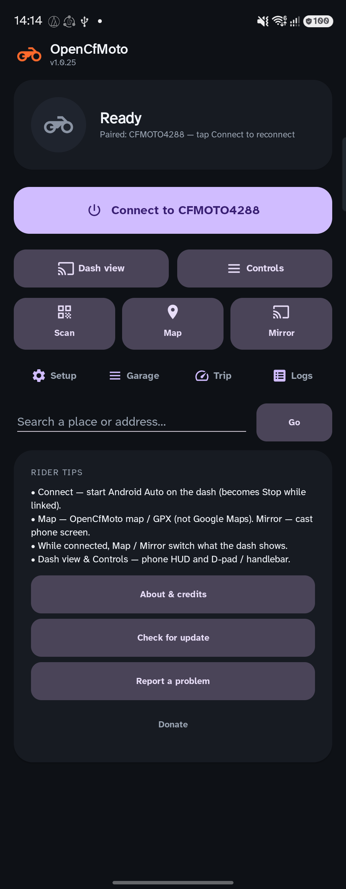&nbsp;
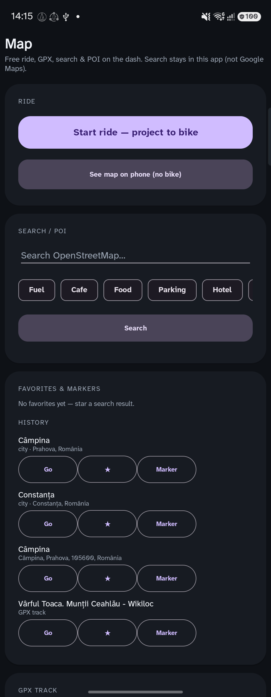&nbsp;
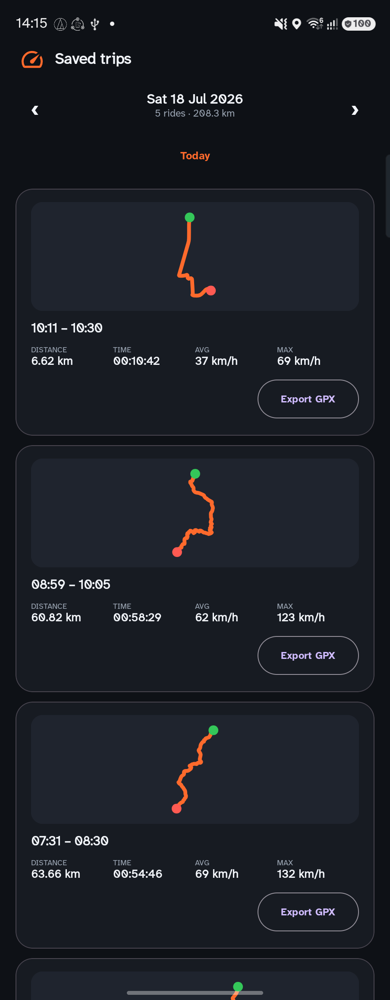

  

### 🎥 Live demo — Android Auto on a CFMoto dash

**▶ [Watch the full demo](docs/media/hud-demo.mp4)** — Google Maps navigation + media, driven from the
dash touchscreen.

 

### 📸 See it on more bikes — [Dash showcase](docs/SHOWCASE.md)

CFMoto · Voge · Morini · Morbidelli · QJ Motor · GOES and more — community photos of Android Auto on the dash.

---

> **Origen y atribución:** **800NK ADV Link no es una aplicación creada desde cero.** Es una
> adaptación específica para la 800NK Advanced basada en el proyecto de código abierto
> [OpenCfMoto](https://github.com/zanderp/open-cfmoto), desarrollado originalmente por
> **Alexandru (zanderp)** con aportes de su comunidad.
>
> **Project origin and attribution:** It is a model-specific adaptation of the open-source
> [OpenCfMoto](https://github.com/zanderp/open-cfmoto) project, originally developed and maintained
> by **Alexandru (zanderp)** with contributions from the OpenCfMoto community. This adaptation builds
> on that work to focus on the CFMOTO 800NK Advanced. Original copyright notices, contributor credits,
> and the GNU AGPL v3 license are preserved in [NOTICE](NOTICE) and [LICENSE](LICENSE).

---

> ⚠️ **Community project — not affiliated with CFMoto, Carbit, or other EasyConnect brands.** If the
> dash shows a **MotoPlay / EasyConnect QR**, OpenCfMoto can try to connect — **no T‑BOX required**,
> US and international. Full model list: **[Supported bikes](docs/SUPPORTED-BIKES.md)** · see it on
> real dashes: **[Dash showcase](docs/SHOWCASE.md)**. Don't rely on it for critical navigation —
> set your route **before** you ride. Use at your own risk.

---

## ✨ Features

| | |
| --- | --- |
| 🗺️ **Android Auto on the dash** | Relays Google Maps / Waze / any AA app to the MotoPlay screen over Wi‑Fi. |
| 👆 **Multi-touch** | Two-finger pinch-to-zoom and full tap/scroll straight from the dash touchscreen (ghost-touch filter for noisy digitizers). |
| 📺 **Dash view** | Big home-screen button — watch and drive the live dash from the phone (touch, pad, fullscreen). |
| 🎛️ **Controls** | Big home-screen button — on-screen D-pad/knob, media volume, and handlebar-button mapping. |
| 🕹️ **Handlebar buttons → AA** | On touchless / focus-mode dashes, ◀/▶/★ (or ▲/▼) navigate Android Auto over Bluetooth — snappy singles, tap / hold / ×2, Teach-my-handlebar, every gesture remappable. |
| 🧭 **Navigate-to + saved places** | Type a destination or map a handlebar button to a saved place for one-press turn-by-turn. |
| 🎙️ **Voice / Assistant** | Streams your (helmet) mic to Android Auto so "Hey Google" sets a destination hands-free. |
| ⚡ **One-tap Connect & Auto-connect** | Remembers your bike; reconnects on launch when in range; Wi‑Fi join timeout + auto re-join after ignition cycles. |
| 📶 **Wi‑Fi AP or Direct (P2P)** | Normal hotspot join, or **Wi‑Fi Direct** for dashes that are Group Owners (e.g. **CL‑C450**). Setup: Auto / AP / P2P. |
| 🖼️ **Screen margins** | Dedicated page — inset Android Auto from top/bottom/left/right (e.g. blank the 800NK Advanced MotoPlay pull-down). |
| 🏍️ **Garage (multiple bikes)** | Name + photo per bike; each keeps its own display, resolution, power, and button settings. |
| 🛰️ **Trip computer + ride logging** | Live speed/distance/duration from GPS, auto-logs every ride, day calendar of saved trips, route thumbnails, **Export GPX**. |
| 📐 **Smart resolution & learned panels** | Auto-fits recognized dashes; remembers measured panel size and picks a better AA resolution next connect. |
| 🌗 **Map dark mode** | Day / Night / Auto — from Setup, Controls, or Dash view; applies live. |
| 🔋 **Battery & power tuning** | Smooth / Balanced / Saver + **Auto** (adapts to heat & Wi‑Fi). |
| 🛟 **Auto-recovery & seamless resume** | Stalled/dropped dash reconnects; long stop parks AA and re-projects when the bike returns. |
| 🔄 **In-app updates** | Optional nag when a newer GitHub Release is available (Download / Skip / Later). |
| 🧰 **Diagnostics & problem report** | Live logs (secrets redacted by default), Share Logs, and Setup → **Report a problem**. |
| 📤 **Share / import bike tuning** | Export profile, resolution, fit, margins & button map as JSON (no passwords / personal prefs) — share on Discord, Import on another phone. |
| 📶 **Wi‑Fi-off alert** | If phone Wi‑Fi is off when connecting, a dialog offers **Wi‑Fi settings** (one tap). |
| 🗺️ **Map / GPX** | Free ride, GPX tracks, OSM search/POI, Home/favorites/markers, parked pin, road routing, voice cues — on the bike dash or phone. |
| 📱 **Mirror phone** | Cast the phone screen when you really need it (screen on; awkward for nav apps). |
| 🌐 **Languages** | Follows the phone language, or set **per-app** on Android 13+: Settings → Apps → OpenCfMoto → **Language**. Draft DE / IT / FR / ES / CA / PT / PL / CS / RO / NL / HU / TR ([docs/TRANSLATIONS.md](docs/TRANSLATIONS.md)). |

---

## 📋 What you need

- **A bike / ATV whose dash can show a MotoPlay / EasyConnect QR** (CFMoto, Voge, Morini, Morbidelli,
  Zontes, Benelli, QJ Motor, GOES/Gladiator, and siblings). **No T‑BOX required.** Works on **US and
  international** units. See **[Supported bikes](docs/SUPPORTED-BIKES.md)** and
  **[Dash showcase](docs/SHOWCASE.md)**. Touch dashes use the screen; non‑touch / focus-mode bikes
  use **Controls** + handlebar buttons. Unknown dashes are learned after the first connect.
- **An Android phone**, Android **10 or newer**.
- **Google Android Auto** (see [step 3](#3-android-auto-setup); 17.4+ also needs **Start head unit server**).
- **OpenCfMoto** from [Releases](https://github.com/zanderp/open-cfmoto/releases/latest) (sideload).
- A **mobile-data plan** is recommended: the phone joins the bike's Wi‑Fi, so maps/traffic use cellular.

No root, no VPN, no PC required to ride.

---

## 🏍️ Supported bikes

**→ Full list (source of truth): [docs/SUPPORTED-BIKES.md](docs/SUPPORTED-BIKES.md)** ·
**→ Dash showcase (photos): [docs/SHOWCASE.md](docs/SHOWCASE.md)**  
(same model list as Setup → Supported bikes in the app)

**Rule:** if the dash shows a **pairing QR**, try OpenCfMoto. Same **Carbit / EasyConnect** framework
used by CFMoto MotoPlay and several sibling brands. T‑BOX / CFMOTO RIDE subscription is **not**
required. US CRCP and international dashes both work. OpenCfMoto projects **wireless Android Auto**
(not Apple CarPlay).

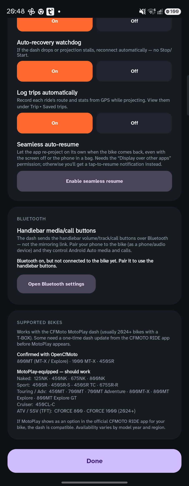

### Confirmed with OpenCfMoto

**CFMoto:** 800MT (MT‑X / Explore / Explore GT / **Ibex 800**) · 1000 MT‑X · 800NK (US CRCP) · 800NK Advanced ·
**675NK** · **675SR‑R** · **700MT Adventure** · **450MT** · 450SR (+ SR‑S / TC) · 450CL‑C / CL‑C450 · **450NK** ·
**150SC** scooter · **CFORCE 850 / 1000** · **GOES Terrox 1000** / **Gladiator G3 1000** (CFORCE rebadges)

**Other brands:** **Voge DS800 Rally / DS900X** · **Moto Morini X-Cape 649 / 700 / Seiemmezzo** ·
**Benelli TRK 702 / 702X** · **Rieju 307** · **Zontes 125X** · **Morbidelli T1002VX / T352X** ·
**QJ Motor SRK800RR / SRK450RR / SRK250RD / SRT 600 / SRV600**

### Other brands (Carbit / EasyConnect)

Try Connect when the dash shows a pairing QR; report results in Discord:

**Voge** (DS800 Rally / DS900X confirmed) · **Moto Morini** (X-Cape 649 / 700 / Seiemmezzo confirmed; 1200 SoftAP
experimental; MotoFun) · **Zontes** (**125X** confirmed) · **Benelli** (e.g. TRK 702 / 702X) · **Rieju** (**307** confirmed) ·
**QJ Motor** (**SRK800RR / SRK450RR / SRK250RD / SRT 600 / SRV600** confirmed; 550/600SX + Fort 4.0 testing) ·
**Morbidelli** / MBP (**T1002VX / T352X** confirmed) · **Longjia** (e.g. V-Bob 650; MotoFUN / Carbit Ride —
unconfirmed, try if QR present) · **Kove** (Thinkerride SoftAP experimental — no dash video yet)

### Full CFMoto list (summary)

| Family | Models |
| --- | --- |
| **Naked (NK)** | 125NK · 450NK · 675NK · 800NK · 800NK Advanced · 800NK Sport · 800NK (US CRCP) |
| **Sport (SR)** | 300SR · 450SR · 450SR‑S · 450SR TC · 500SR VOOM · 675SR · 675SR‑R |
| **Touring / Adventure (MT)** | 450MT · 700MT · 700MT Adventure · 800MT‑X · 800MT Explore · 800MT Explore GT · 1000 MT‑X |
| **Cruiser (CL)** | 450CL‑C · CL‑C450 |
| **Scooter** | **150SC** |
| **ATV / SSV (TFT)** | CFORCE 800 · CFORCE 850 Touring · CFORCE 1000 · CFORCE 1000 Touring · **GOES Terrox 1000** / **Gladiator G3 1000** (CFORCE rebadges, confirmed) |
| **Other** | U10 Pro (where the dash offers the QR) |

Usually **no** projection QR (won’t work unless your unit has one anyway): 800MT Sport · 800MT
Touring · 450SR World Champion Edition · 700CL‑X · PAPIO.

Report a working bike that isn’t listed in **[Discord](https://discord.gg/KNTjJhmFZ6)**.

---

## 🚀 Getting started

### 1. Prepare the bike

While parked, open the **MotoPlay / phone-connection (EasyConnect) screen** on the dash so it shows
its **pairing QR code** — the same QR the official brand / Carbit companion app uses.

### 2. Install the app

The app isn't on the Play Store — you sideload the APK.

1. Download the latest **`OpenCfMoto.apk`** from the
   **[Releases page](https://github.com/zanderp/open-cfmoto/releases/latest)**
   (direct link: <https://github.com/zanderp/open-cfmoto/releases/latest/download/OpenCfMoto.apk>).
2. Tap it in a file manager / your browser downloads to install; allow installation from your
   browser/file manager when Android prompts about "unknown sources".
3. Open **OpenCfMoto** once and grant the permissions it requests:
   - **Location** — required by Android to join the bike's Wi‑Fi (the app doesn't track you) and to
     log trips.
   - **Camera** — to scan the bike's pairing QR code.
   - **Notifications** — so it can keep running in the background while you ride.

> 💡 The **Setup** screen has an *All granted* button that checks every permission at once and
> deep-links to system settings for anything missing.

### 3. Android Auto setup

Android Auto must be installed and allowed to start in "self / head-unit" mode.

1. Install **Android Auto** from the Play Store (often pre-installed) and open it once to accept its
   terms.
2. In Setup, tap **Open Android Auto settings**, scroll to the bottom and tap **Version** about **10
   times** to unlock Developer settings.
3. In the **⋮ Developer settings** menu, turn **on** *"Add new cars to Android Auto"* / *"Unknown
   sources"* (wording varies by version).
4. **Android Auto 17.4+:** in that same **⋮** menu, tap **Start head unit server**, then return to
   OpenCfMoto and tap **Connect**. The app dials that server automatically. You may need to start
   the server again after a reboot or an Android Auto update.

Do **not** uninstall Android Auto updates — that is no longer needed and is the wrong fix.

Steps 1–3 are once. Step 4 is once per reboot / Android Auto update on 17.4+.

### 4. Connect and ride

1. In OpenCfMoto tap **Scan bike** and point the camera at the dash's QR code. The app reads your bike
   model + Wi‑Fi and remembers it. **If the Android QR won't scan or connect**, switch the dash to
   the **iOS / CarPlay QR** and scan that instead (same Wi‑Fi; often more reliable).
2. Android Auto starts in the background and the phone pops a **Wi‑Fi dialog** to join the bike's
   hotspot (e.g. *CFMOTO4288*) — tap **Connect / Allow**.
3. The dash connects and **Android Auto appears on the dashboard**. 🎉

From then on, drive Android Auto from the **dash touchscreen**, or open **Dash view** / **Controls**
on the phone. Your phone can be locked or in your pocket; a persistent notification keeps the link
alive.

**Next time**, just tap **Connect to `<your bike>`** — or leave **Auto-connect** on and it links up on
launch whenever the bike's Wi‑Fi is in range.

**To stop:** tap **Stop** in the app. Closing or killing the app also ends projection cleanly.

---

## 🧭 Feature guide

### 🛰️ Trip computer & ride logging

The **Trip** screen is a GPS-driven ride computer showing live speed, distance, duration, and
max/avg speed. Speed/distance come from the phone's GPS (the bike doesn't share telemetry over the
mirroring link).

- **Automatic logging** — with *Log trips automatically* enabled, every **Android Auto projection**
  and every **built-in Map** session (free ride / GPX / Navigate-to on the dash or phone preview)
  records a ride in the background into the same Saved trips list, auto-segmenting when you stop
  for a while. Manual **Record ride** on the map still works if you turned auto-log off.
- **Saved trips** — browse by **day** (‹ › calendar), each card shows a **route thumbnail**, stats, and
  **Export GPX**; tap a card for the full OpenStreetMap route, or long-press to delete.
- Manual **Start / Pause / Reset** controls are there too.

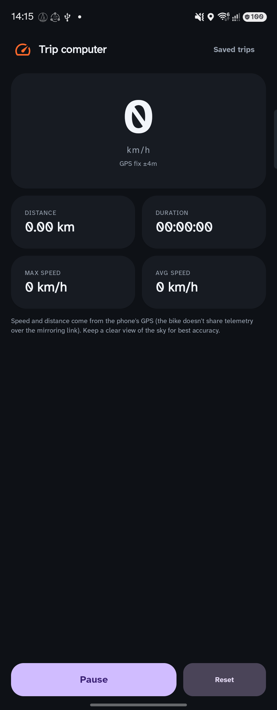&nbsp;
&nbsp;
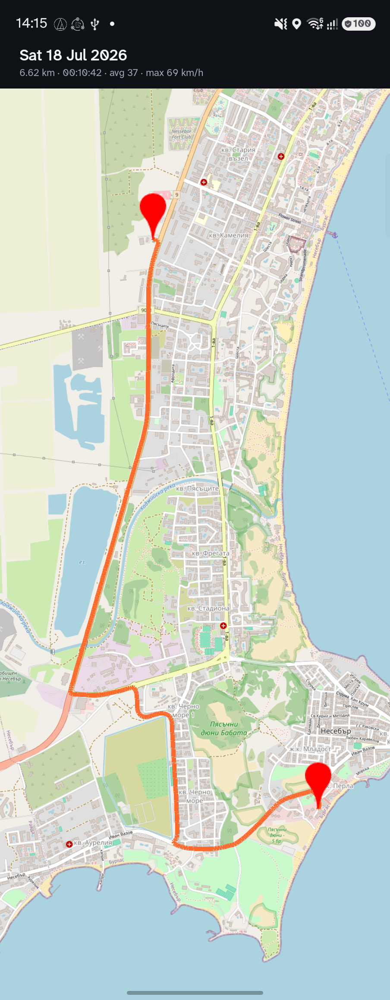

 

### 🏍️ Garage (multiple bikes)

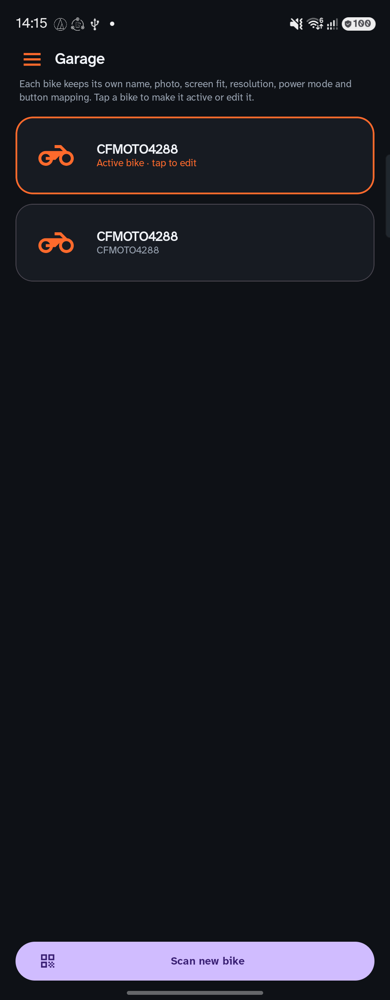

The **Garage** holds every bike you've paired. Tap a bike to **make it active**, **rename** it, give it
a **photo**, or **remove** it — and **Scan new bike** to add another. The active bike is what one-tap
**Connect** and auto-connect target.

Best of all, **settings are per-bike**: screen fit, resolution, power mode, map theme, and your
handlebar-button mapping are all remembered separately for each motorcycle, so switching bikes restores
that bike's exact setup. (Your existing single-bike settings carry over as the default for every bike,
and a freshly scanned bike inherits them until you customize it.)

 

### 📐 Resolution, orientation & screen margins

Android Auto only supports a fixed set of resolutions, and dashes come in different shapes. In
**Setup ▸ Resolution & orientation**:

- **Auto** fits recognized dashes automatically. For an **unrecognized** dash, the app reads the
  panel size the dash reports, **remembers it**, and on the next connect picks a better AA resolution
  (learned geometry). You may see a one-time letterboxed frame the first time — reconnect once.
- Manual overrides: **Landscape 800×480 / 1280×720 (HD)** and **Portrait 720×1280 / 1080×1920 (HD)**.
- **Screen fit** — *Fill* (crop), *Fit* (letterbox), or *Stretch*.
- **Screen margins** (Setup → dedicated page) — inset Android Auto from **top / bottom / left / right**
  independently (dash pixels). Useful on **800NK Advanced** so the MotoPlay pull-down doesn’t steal
  swipes. Reset returns to the active profile’s defaults.

> HD is sharper but heavier and can black-screen on some dashes — drop to a smaller size or Auto if
> that happens.

### 🌗 Map dark mode

Switch the dash map between light and dark to match the light. Set it from **Setup ▸ Map theme**, the
**Controls** screen, or the **🌗** button in the **Dash view** — all three share one setting and apply
**instantly** while you're projecting (no reconnect):

- **Auto** — dark at night, light by day. It follows your phone's dark theme if you have one scheduled,
  and falls back to a sunset/sunrise clock so it still flips on a phone left on a fixed theme.
- **Day** — always the light map.
- **Night** — always the dark map.

It works by reporting the head unit's *night* state to Android Auto, so Google Maps / Waze switch their
own day/night map styles.

### 🔋 Battery & power, startup & recovery

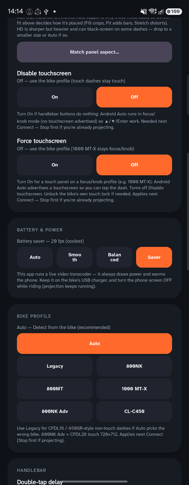

This app runs a live video transcoder, so it always draws power and warms the phone. To manage that:

- **Battery & power** — cap the frame rate: *Smooth* / *Balanced* / *Saver* (coolest), or *Auto*
  (adapts bitrate & fps to phone heat and bike Wi‑Fi). Defaults to **Balanced**. Keep the phone
  on the bike's USB charger and turn its screen **off** while riding (projection keeps running).
- **Auto-connect on launch** — start projecting automatically when a paired bike's Wi‑Fi is in range.
- **Auto-recovery watchdog** — if the dash drops or the stream stalls, reconnect automatically.
- **Seamless resume** — see below.
- **Log trips automatically** — record every ride's route + stats while projecting **or** using the
  built-in Map (same Saved trips list).

 

### 🔄 Seamless resume (stop-and-go rides)

Stopped for fuel, a coffee, or a quick photo? When the bike's Wi‑Fi drops, the app keeps Android Auto
alive for a ~1 minute grace window (so brief blips resume instantly). If the bike stays off longer, it
**parks** the projection — tearing down the video transcode so the phone stops heating and draining —
and quietly watches for the bike's Wi‑Fi to come back. When it does, it **re-projects Android Auto and
maps automatically**. It keeps watching until you tap **Stop**, and it's gated behind the *Auto-recovery*
setting.

**For fully hands-free resume with the phone in a bag or the screen off**, enable one extra permission:

> **Setup ▸ Startup & recovery ▸ Seamless auto-resume ▸ “Enable seamless resume”** → turn on
> **Display over other apps** for OpenCfMoto.

Android blocks apps from relaunching Android Auto from the background unless they hold this permission.
- **Granted:** the app resumes projection entirely on its own — no touch needed, even locked/stowed.
- **Not granted:** everything still works, but resume ends with a **“Bike reconnected — tap to resume”**
  notification; one tap re-projects.

The permission is optional and off by default. Recommended if you keep your phone pocketed or in a
backpack while riding.

 

### 🎛️ Handlebar & on-screen controls

**Touchscreen dashes** (800MT Explore with a working touch panel, 800NK Advanced, …) are driven by
touch. The **1000 MT‑X** and **non-touch** CFDL16-class bikes (450SR, 675SR, 300SR, 450NK, 675NK,
450MT, 450CL‑C, …) — and any dash where you turn on **Disable touchscreen** — are driven by the
**handlebar buttons** and an **on-screen pad**. Android Auto stays in focus/knob mode so those
controls can move a cursor. (On the 1000 MT‑X you can still unlock the bike's own touch lock for
native menus; mirrored AA is handlebar-first so buttons keep working.)

On the home screen, tap the big **Controls** button (next to **Dash view**).

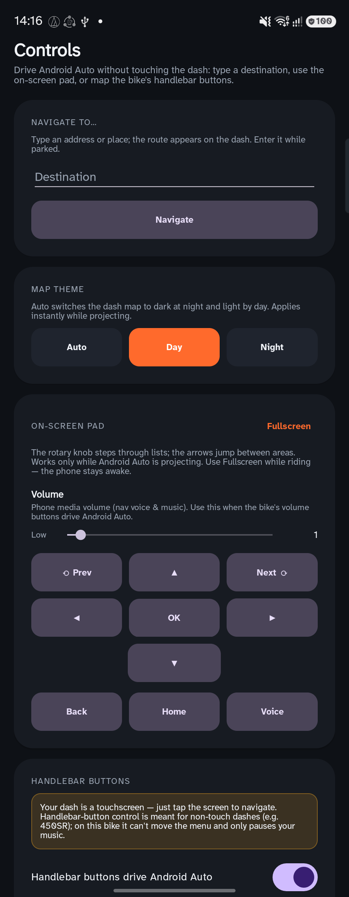&nbsp;
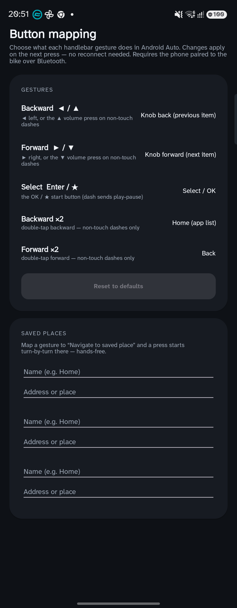

 

**Handlebar buttons → Android Auto.** The buttons reach the phone over **Bluetooth** (AVRCP) — *not*
the mirroring link — so you must **pair the phone to the bike over Bluetooth** first. Turn on
*Handlebar buttons drive Android Auto*. The app maps by **meaning** (Backward / Forward / Select),
then auto-routes whatever your bike sends — ▲/▼ *volume* on many non-touch dashes, or ◀/▶ *track*
keys on the 800MT 5-way — into those gestures.

**Quick setup (intuitive path)**

1. Pair **Bluetooth** phone ↔ bike (audio / hands-free).
2. Open **Controls → Customize buttons** — the top line shows the **live connected BT device**
   (tap it to open system Bluetooth settings if nothing is connected).
3. **Apply cluster preset…** for your left pod (photos below), or leave defaults.
4. Tap **Teach my handlebar…** if ▲/▼ never move focus (or the phone volume feels “stuck”):
   mark **▲/▼ absent** so we stop pinning music volume waiting for rockers the bike never sends.
   Leave *untested* and we’ll auto-mark absent after ~90 s of streaming with no ▲/▼ events.
5. Ride — **singles fire immediately** (snappy); a second tap in the double-tap window still runs ×2.

#### Which left switch do you have?

CFMOTO ships more than one left pod. **Doubles and long-press are not equal across them** — pick the
photo that matches your bars, then in **Controls → Customize buttons → Apply cluster preset…** load
the matching config (or follow the tables below by hand).

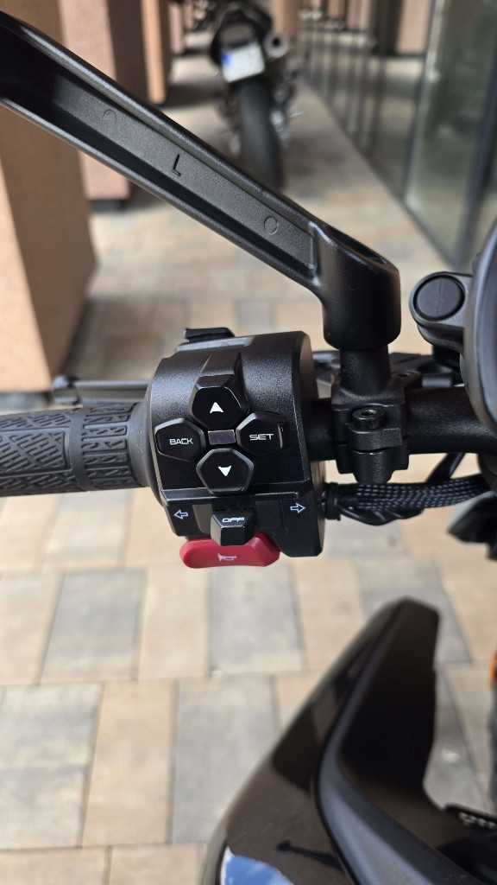&nbsp;
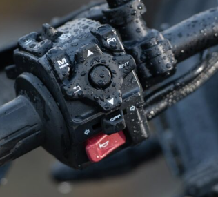&nbsp;
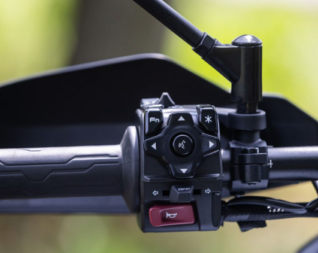

| Photo | Cluster | What the bike can send | Preset in the app |
| --- | --- | --- | --- |
| **A** | **BACK / SET** diamond (▲ ▼ BACK SET, turn signals, red horn) | Reliable **taps**. Discrete hold / Select ×2 usually missing; ▲▲/▼▼ *volume* ×2 often still works. | **BACK / SET diamond (limited)** |
| **B** | **MODE / ENT** (M MODE, +, Fn, center, ⌄ back, ENT, ▲ ▼) | Taps + often Select ×2; holds / ◀◀ ▶▶ best-effort (tune delays). | **MODE / ENT cluster** |
| **C** | **5-way Explore** (Fn, ★, D-pad with voice in the center) | Full **tap / hold / ×2** on ◀ / ▶ / ★ (verified on 800MT Explore). | **5-way Explore (Fn / ★ / voice)** — shipped default |

**Actions you can assign** to any gesture (Customize buttons): Do nothing · Knob forward / back · Select / OK · Back · Home · Assistant · D-pad ↑ ↓ ← → · Navigate to saved place 1 / 2 / 3.

##### Cluster C — 5-way Explore (recommended default)

Use this if your left pod looks like photo **C** (voice icon in the middle of the D-pad).

| Gesture | Physical | Default action |
| --- | --- | --- |
| **Backward** | ◀ (or ▲ volume on some non-touch dashes) | Rotary knob back (move focus) |
| **Forward** | ▶ (or ▼ volume) | Rotary knob forward (move focus) |
| **Select** | ★ / start / Enter — quick tap | Select / OK |
| **Backward (hold)** | press and hold ◀ | Do nothing (D-pad ↑ unused on these AA screens) |
| **Forward (hold)** | press and hold ▶ | Do nothing (D-pad ↓ unused) |
| **Select (hold)** | press and hold ★ / Enter | Home (app list) |
| **Backward ×2** | double-tap ◀ | D-pad left (into / across apps) |
| **Forward ×2** | double-tap ▶ | D-pad right |
| **Select ×2** | double-tap ★ / Enter | Back (to the launcher bar) |

That’s **9 remappable gestures** on three physical buttons (tap / hold / ×2 each). Holds need a real
key-up from the bike (track-key ◀/▶ / ★) — the ▲/▼ *volume* path on some non-touch dashes has no
release, so hold is unavailable there (×2 via a big volume jump still works).

**▶ [Watch the full silent demo](docs/media/buttons-demo.mp4)** — ◀ / ▶ / ★ taps, holds, and double-taps.

**How to ride with it**

1. Pair Bluetooth phone ↔ bike, connect mirroring, turn on *Handlebar buttons drive Android Auto*.
2. **◀ / ▶** = knob (move the list). **★ tap** = Select / OK.
3. **◀ ◀ / ▶ ▶** = D-pad left / right (into apps / across the bar). **★ ★** = **Back**.
4. **★ hold** = **Home**. ◀/▶ holds are unused by default (remap if you want).
5. Remap any of the nine rows in Customize buttons (including *Navigate to saved place 1/2/3*).
6. Timing: Setup → **Double-tap delay** / **Hold delay**. See [Tune timing & verify in Logs](#tune-timing--verify-in-logs).

##### Cluster A — BACK / SET diamond (limited)

Use this if your left pod looks like photo **A**. The bike firmware usually collapses a physical
long-press into one short AVRCP tap (~30–100 ms) and does **not** emit a discrete double-tap — we
cannot invent hold / Select ×2 in software if those events never leave the bars.

Preset **BACK / SET diamond (limited)** — all nine rows:

| Gesture | Action | Notes |
| --- | --- | --- |
| **Backward** | Knob back | Instant (no double-tap wait) |
| **Forward** | Knob forward | Instant |
| **Select** | Select / OK | Instant |
| **Backward (hold)** | Do nothing | Firmware usually won't send a real hold |
| **Forward (hold)** | Do nothing | same |
| **Select (hold)** | Do nothing | same |
| **Backward ×2** | **Back** | Often via hard ▲▲ volume flick |
| **Forward ×2** | **Home** | Often via hard ▼▼ volume flick |
| **Select ×2** | Do nothing | Discrete double Select almost never arrives |

**How to ride with it**

1. Apply that preset — taps feel snappy; try a firm double-flick on ▲/▼ for Back / Home.
2. If volume ×2 never fires, use the **on-screen pad** (Controls / Dash view) for Back / Home, or remap one single.
3. Setup timing sliders will not create hold/Select ×2 if the firmware isn't sending them.
4. Optional: map Select to *Navigate to saved place 1* if you mainly need one-press nav.

##### Cluster B — MODE / ENT

Use this if your left pod looks like photo **B** (ENT on the right, return arrow on the left, MODE / + / Fn above).

Preset **MODE / ENT cluster** — all nine rows:

| Gesture | Action | Notes |
| --- | --- | --- |
| **Backward** | Knob back | Primary navigation |
| **Forward** | Knob forward | Primary navigation |
| **Select** | Select / OK | ENT / center |
| **Backward (hold)** | Do nothing | Remap if your dash sends a real hold |
| **Forward (hold)** | Do nothing | same |
| **Select (hold)** | Home | Needs key-up |
| **Backward ×2** | D-pad left | Best-effort (or volume-coalesced) |
| **Forward ×2** | D-pad right | Best-effort |
| **Select ×2** | Back | Try two firm taps inside ~300–450 ms |

**How to ride with it**

1. Apply that preset.
2. Singles are snappy (no wait); a second tap in the double-tap window still fires ×2 (D-pad ←/→ / Back).
3. Confirm ★★ → Back and ◀◀ / ▶▶ → D-pad ←/→ in a quiet driveway before relying on them in traffic.
4. MODE / Fn / + on the pod are usually **bike-native** (dash menus) — not remapped unless your firmware also emits AVRCP (check Logs for `[BTN] media key …`).

##### Shared tips (every cluster)

- Every gesture stays **remappable** after a preset (knob, D-pad, select, back, home, Assistant, do-nothing, or *navigate to a saved place*).
- **Snappy singles** — a single press runs its action **immediately**; a second press in the
  double-tap window still fires ×2. (No lag waiting to guess tap vs double.)
- **Teach my handlebar** — on the mapping screen: mark which sources this bike actually sends
  (▲/▼ volume rocker vs ◀/▶ track keys). Marking ▲/▼ **absent** stops the “volume hostage”
  (phone music volume pinned forever when firmware never emits rocker events — common on some
  NK Adventure units). Per-bike; reset anytime.
- **Live Bluetooth line** — mapping screen shows the *currently connected* audio device, not an
  old paired headset. Tap the line → system Bluetooth settings.
- **On-screen pad + Navigate to…** — Controls also has a D-pad, rotary knob, and a **"Navigate to…"** box. Save up to three places and map them to a handlebar button for **one-press** navigation with the phone in your pocket (*Display over other apps* required for background launch — the app prompts you when a nav button is mapped).
- **Voice** — map any gesture (or tap **Voice**) to the Assistant; OpenCfMoto streams the mic to Android Auto (grant microphone when asked).
- **Link drops** — auto-recovery re-probes the bike with a larger reconnect budget and faster early
  retries; after the budget is spent, the watchdog re-arms so a bike back in range can link again
  without a full Stop → Connect (Setup → auto-recovery must stay on).

##### Tune timing & verify in Logs

Changes apply on the **next press** (no reconnect).

1. **Setup → Handlebar**
   - **Double-tap delay** — `200 ms` · `300 ms` (default) · `450 ms` · `1000 ms` (slow doubles). Longer = easier ×2 when each physical click is slow. With snappy singles (default), the single action still fires immediately; this window only decides when a second press upgrades to ×2.
   - **Hold detection** — On (default) or **Off**. Turn **Off** when a long physical press must still count as a tap / ×2 (otherwise Hold delay eats it). Pair with `1000 ms` double-tap if needed.
   - **Hold delay** — `500 ms` · `600 ms` (default) · `800 ms`. Ignored when Hold detection is Off.
2. **Controls → Customize buttons** — remap any of the 9 gestures; use **Apply cluster preset…** first if you changed bikes; run **Teach my handlebar…** if rockers never arrive.
3. **Diagnostics (home → Logs)** while projecting with *Handlebar buttons drive Android Auto* **ON** — press the bars and watch for `[BTN]` lines:

| Log line | Meaning |
| --- | --- |
| `media key KEYCODE_MEDIA_PREVIOUS/NEXT/PAUSE down` | Raw key reached the phone |
| `volume UP/DOWN (… jump=N)` / `×2` | ▲/▼ volume path; `jump≥3` or `×2` = coalesced double |
| `backward\|forward\|select held 72ms → tap` | Released before hold delay → counted as tap (then may wait for ×2) |
| `… held 640ms → long press` | Hold recognized (ms ≥ your Hold delay) |
| `… key-repeat → long press` | Dash sent key-down repeats while held |
| `Backward ×2 → …` / `Forward ×2 → …` / `Select ×2 → …` | Double-tap fired and ran its mapped action |
| `Backward (hold) → …` / `Forward (hold) → …` / `Select (hold) → …` | Hold fired and ran its mapped action |
| `Backward → Knob back` (etc.) | Single tap committed |
| `volume rocker marked PRESENT` / `ABSENT` | Teach / auto-probe decided whether to pin phone volume |
| `skip pin … volume rocker ABSENT` | Volume hostage off — phone volume behaves normally |

**How to tune from the log**

- Want ×2 but only see `held … → tap` then a single action: raise **Double-tap delay** to **450 ms**, or tap faster inside the window.
- Hold always shows `held 80ms → tap`: the bike isn’t keeping the key down — set that hold row to *Do nothing* (typical BACK/SET).
- Hold shows `held 550ms → tap` with delay at 600: drop **Hold delay** to **500 ms**, or hold a bit longer.
- No `[BTN]` lines at all: Bluetooth not paired / capture switch off / music app stole focus (see below — look for `reclaiming media buttons`).
- Phone volume stuck / no ▲▼ nav: **Teach my handlebar → ▲/▼ absent**, or wait for auto-absent after ~90 s streaming.

##### Handlebar buttons vs music apps

With *Handlebar buttons drive Android Auto* **ON** (default), the bars drive the Android Auto UI
(not track-skip). Music can keep playing — control it by navigating that UI with the bars or the
on-screen pad. Turn the switch **OFF** only if you want the physical bars to control media again.

If Spotify (or another player) steals the buttons mid-ride: press **★** to **pause** the song so
OpenCfMoto can reclaim the bars for navigation, then start music again when you want.

### 📺 Dash view (watch & control from the phone)

Tap **Dash view** on the home screen (next to **Controls**) to see the **live dashboard inside the
app**. It mirrors exactly what's on the bike, so you can set up navigation or pick music on the phone
before you ride — then pocket it. On touch dashes you can **drive it with your fingers**
(pinch-to-zoom included); a bottom bar (knob, D-pad, OK, Back, Home, voice) works on every dash. Hit
**⛶** for fullscreen; **Back** exits. The **🌗** button cycles [map dark mode](#-map-dark-mode) live.

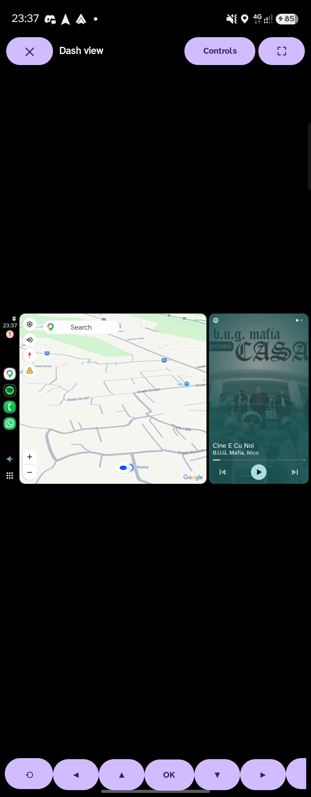

 

### 🧰 Diagnostics, updates & About

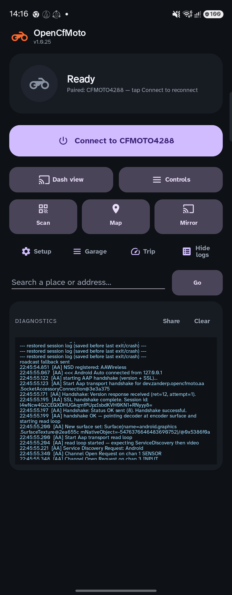

- **Logs** — live connection narrative. **Share** exports the log (**Wi‑Fi passwords / serials are
  redacted by default**; Setup → *Include secrets in shared logs* only if you need them locally).
- **Setup → Report a problem** — short form + diagnostics + redacted log in one shareable file.
- **Setup → Share JSON / Import…** — export bike tuning (profile, resolution, fit, margins, buttons,
  transport) — no Wi‑Fi passwords and no personal prefs (map theme, saved places, …). Import applies
  onto your selected bike.
- **Wi‑Fi off** — if you tap Connect with phone Wi‑Fi disabled, a dialog opens with a **Wi‑Fi settings** button.
- **Setup → Check for update** — looks at GitHub Releases; the app also nags at most once a day when
  a newer build exists (optional Download / Skip / Later). Bike Wi‑Fi has no internet, so checks run
  on cellular/home Wi‑Fi.
- **About** (home header or Setup) — copyright, credits, **Discord**, and **Donate** (Ko‑fi).

 

---

## 🗺️ Map / GPX (adventure nav)

Android Auto (Maps / Waze) does **not** replace adventure tracks. **OpenCfMoto Map / GPX** projects a
bike-sized map to the dash (own-content path — MapLibre on phone, osmdroid on the bike stream) using
OpenStreetMap data:

| Mode | What it does |
|------|----------------|
| **Free ride** | Map + GPS — speed, altitude, heading-up chase zoom, Follow / North-up |
| **GPX track** | Import `.gpx`, optional offline tiles, turn cues + voice, progress |
| **Search / POI** | OSM search + fuel/cafe/parking/… chips → preview routes → **Go** |
| **Type on phone** | Tap Search on the bike → keyboard on the phone home field; results on the dash |
| **Home / favorites / markers** | Long-press drop a pin to set Home or a marker; favorites from search |
| **Parked** | Mark / update / clear parking; navigate back to the pin |
| **Navigate-to** | Road routes (OSRM / ORS / offline) with Fast / Fun alts; Recalc re-routes |
| **Circuit** | There-and-back loop to a place and home again |
| **Speed limit** | Nearby OSM `maxspeed` on the dash (Overpass) |
| **Arrival / parking sheet** | Real arrival offers Park / Find parking — **End** does not fake “Arrived” |
| **Region packs** | Offline PMTiles + routing graphs (download on home Wi‑Fi) |
| **Map backup** | Export / import favorites, markers, history, parked, map prefs |

**Your own API keys (optional).** Map tiles, search/POI, and basic routing work out of the box via
public OpenStreetMap / OSRM / Valhalla endpoints — **no key required**. For stricter
avoid-highways / avoid-tolls and more reliable ORS routing, paste your own free
[OpenRouteService](https://openrouteservice.org/) API key in **Map hub → OpenRouteService API key →
Save routing key**. Your key stays on the phone (never uploaded by OpenCfMoto). Clear the field to
fall back to the free routers again. Offline region packs also route without any online key.

Dash widgets: **speed / left / ETA / alt / limit**, maneuver cue, **End / Park / Recalc**, Follow,
Heading/North, Voice, zoom. Phone can stay pocketed — or type destinations from the home search bar
while the map is on the bike.

**Mirror app** is only for casting the phone UI (needs screen on / awkward aspect). Prefer **Map** for
OpenCfMoto routes and **Connect** for Maps/Waze Android Auto.

## 🔘 Button reference

| Button | What it does |
| --- | --- |
| **Connect / Stop** | Connect starts Android Auto on the dash; becomes **Stop** while linking or projecting. |
| **Scan · Map · Mirror** | Scan QR; Map = OpenCfMoto Map/GPX; Mirror = cast phone. While connected, Map/Mirror switch content. |
| **Dash view · Controls** | Phone HUD and D-pad / handlebar (same row). |
| **Dash view** | Live in-app mirror of the dash — touch + on-screen controls. |
| **Controls** | On-screen D-pad/knob, volume, handlebar mapping, Navigate-to. |
| **Setup** | Permissions, AA setup, display/margins, Wi‑Fi transport, profiles, updates, About. |
| **Garage** | Manage bikes — select, rename, photo, add/remove (per-bike settings). |
| **Trip** | GPS trip computer + saved rides and route maps. |
| **Logs** | Show/hide diagnostics (Share / Clear). |
| **About** | Copyright, credits, Discord, Donate. |

---

## 🩺 Troubleshooting

**Normal behavior**
- A brief black/blank moment on the dash while it connects, then the map appears.
- Opening **All Apps** on the dash or **taking a call** may freeze the dash for a couple of seconds,
  then resume.
- Navigation **voice prompts** come out of your phone / paired helmet headset, not the bike speakers.

**If something's wrong**

| Symptom | Try this |
| --- | --- |
| App **won't connect** / keeps retrying, or the dash shows **"device is not on the network"** | Usually the **dash Wi‑Fi** is stuck. On the phone-connection screen, **toggle Android ↔ iOS (CarPlay) QR** to restart the hotspot, then **Connect** again (scanning the **iOS QR** is fine — often works when the Android one is flaky). After an ignition cycle the app **re-requests Wi‑Fi** automatically; some firmwares still need the pairing/QR screen once. |
| **CL‑C450 / DIRECT‑…** never joins | In Setup set Wi‑Fi to **P2P** (or Auto). These dashes are often Wi‑Fi Direct Group Owners, not a normal AP. |
| Dash stays **blank** and the app says to **close the official CFMoto app** | The official CFMoto / EasyConnect app grabs the same link ports, so the bike connects to *it* instead. The app pops a prompt with **Close & retry** (best-effort) and **App settings** (tap *Force stop*); do that and reconnect. |
| App reports **VPN** blocking bike Wi‑Fi | Always-on VPN with “Block connections without VPN” returns EPERM when pinning sockets to the bike AP. Turn the VPN off for the ride, disable that kill-switch, or allow LAN / local network in the VPN app — then Connect again. |
| Dash stays **black** after connecting | Tap **Stop**, then **Connect** / **Scan bike** again. Make sure the dash is on its phone-connection screen. |
| **No Wi‑Fi dialog** appears | Confirm the Location permission is granted; move the phone next to the bike; tap **Stop** and retry. Some phones show the dialog behind Android Auto — swipe back to OpenCfMoto. |
| **Android Auto never starts** | On AA 17.4+: open Android Auto → tap Version 10× → ⋮ → **Start head unit server**, then Connect. Also re-check [step 3](#3-android-auto-setup) (developer mode + unknown sources). Do **not** uninstall Android Auto updates. |
| **Auto-connect doesn't fire** | Ensure *Auto-connect* is On, the bike is paired, and its Wi‑Fi is in range; open the app or return to it to retry. |
| Picture is **stretched / letterboxed** on an unknown bike | Reconnect once so it learns the dash shape, or set the orientation/size manually in Setup. |
| Dash **froze** and didn't recover | With *Auto-recovery* on it should reconnect itself; otherwise tap **Stop** then **Connect**. |
| **Didn't resume on its own** after a long stop | Enable **Seamless resume** (Setup ▸ Startup & recovery → *Display over other apps*) so the app can re-project with the screen off; otherwise tap the **“Bike reconnected”** notification. |

**Getting help:** reproduce the issue, then **Logs ▸ Share** or **Setup → Report a problem**, and drop
the file in **[Discord](https://discord.gg/KNTjJhmFZ6)**.

---

## 💬 Community

Got a question, a log to share, or a bike you'd like supported? **Join the
[Open CFMoto Discord](https://discord.gg/KNTjJhmFZ6).** It's the fastest place to get help, compare
notes across bikes/phones, share captures that help add new dash profiles, and hear about new releases.

---

## 📝 Good to know / limitations

- **Set your destination before riding.** Enter navigation while parked.
- Works over the bike's **Wi‑Fi** — keep the phone reasonably close to the dash.
- The live transcode **warms the phone and uses power** — charge it and turn the screen off while
  riding.
- On unsupported bikes or in poor Wi‑Fi you may hit the occasional hiccup and need a **Stop → Connect**.

---

## 🛠️ Building from source

Most riders can just install the release APK. To build it yourself:

1. Install **Android Studio** (bundles the JDK + Android SDK).
2. Create `local.properties` in the repo root pointing at your SDK, e.g.
   `sdk.dir=C:\\Users\\<you>\\AppData\\Local\\Android\\Sdk` (Windows) or
   `sdk.dir=/Users/<you>/Library/Android/sdk` (macOS). This file is git-ignored.
3. Build the debug APK:
   - Android Studio: open the project and **Run**, or
   - CLI: `./gradlew assembleDebug` (Windows: `gradlew.bat assembleDebug`). The APK lands in
     `app/build/outputs/apk/debug/`.

Requires JDK 11+ (Android Studio's bundled JBR works). The build uses the Gradle configuration cache
for fast incremental rebuilds.

---

## 🙏 Acknowledgements

This project stands on the shoulders of the people who reverse-engineered the CFMoto MotoPlay link
and built the Android Auto plumbing before us. Huge thanks to:

- **[dcoletto/open-cfmoto](https://github.com/dcoletto/open-cfmoto)** — the original CFMoto EasyConnect
  mirroring app this is based on.
- **[richardbizik/open-cfmoto](https://github.com/richardbizik/open-cfmoto)** — 1000 MT‑X support and
  profile work.
- **[BojanJ/open-cfmoto](https://github.com/BojanJ/open-cfmoto)** — fuller Android Auto integration.
- **[ionutradu252/open-cflink](https://github.com/ionutradu252/open-cflink)** — handlebar controls,
  on-screen pad, navigate-to, Assistant mic, screen margins, log redaction, update checker, ghost-touch
  / stitch, reconnect polish, and 800NK Advanced geometry.
- **[eugen0309/open-cfmoto](https://github.com/eugen0309/open-cfmoto)** — Wi‑Fi Direct (`BikeWifiP2p`)
  and CL‑C450 path.
- **[Martin Escudero](https://github.com/martinescudero)** — Android Auto 17.4+ head-unit-server
  dial-out, so current Play Store Android Auto works again.
- **[headunit-revived](https://github.com/andreknieriem/headunit-revived)** by *andreknieriem* — the
  Android Auto (AAP) receiver foundation.

Maintained by **Alexandru** ([alexandru.rocks](https://alexandru.rocks)) — see **About** in the app.
Thank you to everyone who shared logs, captures, and bike reports. Technical notes live in
[`docs/`](docs/).

---

## 📜 License

OpenCfMoto is licensed under the **[GNU Affero General Public License v3.0](LICENSE)** (AGPL-3.0-or-later).
Copyright © 2026 **Alexandru** ([alexandru.rocks](https://alexandru.rocks)) and the OpenCfMoto
contributors. See [`NOTICE`](NOTICE) for the full copyright and attribution breakdown.

**What that means:** you're free to use, study, modify, and share the app. But if you distribute it —
or run a modified version as a network-accessible service — you **must** release your complete
corresponding source under the AGPL-3.0 and keep the copyright/attribution notices intact. **Nobody
can take OpenCfMoto closed-source or ship a proprietary product built on it.**

> **Why AGPL:** the Android Auto receiver (`dev.coletz.opencfmoto/aa/`) is derived from the AGPLv3
> project [headunit-revived](https://github.com/andreknieriem/headunit-revived), so the combined work
> is AGPL-3.0 by inheritance. This is the strongest copyleft available and is a deliberate choice to
> keep the project — and every fork of it — open.

### 💼 Commercial licensing

Want to use the *original* OpenCfMoto code under terms other than the AGPL (for example, in a closed
product)? Those contributions are owned by the copyright holder and can be **separately licensed** —
reach out via [alexandru.rocks](https://alexandru.rocks) to discuss. Note that any AGPLv3 upstream
components (e.g. headunit-revived) would still need to be relicensed by their authors or replaced.

### 🤝 Contributing

Contributions are welcome under the AGPL-3.0. By submitting a pull request you certify the
[Developer Certificate of Origin](https://developercertificate.org/) (sign commits with `git commit -s`),
agree that your contribution is licensed under the AGPL-3.0, and grant the project maintainer the right
to also offer your contribution under a separate commercial license. This keeps dual-licensing possible
without every contributor holding a veto.

**Translations** — the UI follows the phone language (de / it / fr / es / pt / pl / cs / ro / nl drafts
ship today). On **Android 13+** you can also set a language just for this app:
**Settings → Apps → OpenCfMoto → Language** (no in-app picker yet). Improve any locale by editing
`app/src/main/res/values-<lang>/strings.xml` and opening a PR. See
**[docs/TRANSLATIONS.md](docs/TRANSLATIONS.md)**.

## 🔒 Privacy

OpenCfMoto is **local-first**: no account, no ads. Bike profiles, trip logs, and full diagnostics
stay on your phone. Optional **anonymous** install pings + crash reports (random UUID only) can be
turned off under Setup → Privacy — details in **[PRIVACY.md](PRIVACY.md)**.

Built with ❤️ for the CFMoto community — [join us on Discord](https://discord.gg/KNTjJhmFZ6).

